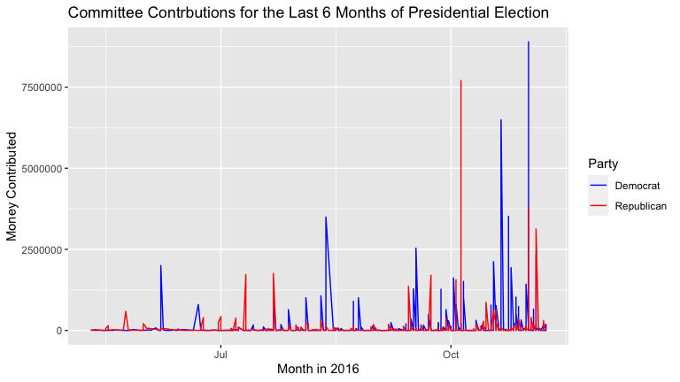

2016 Presidential Elections Committee Contributions
================

-   Authors: Nicole Tresvalles & Hamssatou Almahamoudou Maiga

## Summary

Given the fec16 package, developed by Prof Ben Baumer, Rana Gahwagy,
Irene Ryan, and Marium A. Tapal from Smith College, we were tasked to
“follow the money” and make sense of the data given to us.

When “following the money” we saw many relationships, but we decided to
focus on the impact of different committees in the 2016 Presidential
Election. Since this election was incredibly important, we wanted to
know how each of the main parties, Democrat and Republican, received
funding especially in the key “swing” states. Thus, our main question
is: How did committees from the swing states contribute to the parties
in the 2016 presidential election?

## Comparing Contributions in 2016 Presidential Election in the Swing States (With and Without Virginia)

When analyzing the contributions data set, specifically focusing on the
swing states, we found an outlier: Virginia. Virginia, a Democrat
leaning state, seemed to have contributed a significant amount of money
that greatly alters the data if we removed it. As can be seen in the
visualization, if Virginia is included, Clinton received more money,
around $60,000,000 which is almost double Trump’s contributions. Without
Virginia, Trump received more money, with Trump receiving a little more
than double of Clinton’s contributions. This means, that the committees
in Virginia played a significant role in contributing money to the
presidential candidates.

According to the [New York
Times](https://www.nytimes.com/elections/2016/results/virginia), the 13
electoral college votes of Virginia went to Clinton , with more of the
big cities and populated areas voting blue. The graph provided (with
Virginia) shows that there is a relationship between the amount of
committee contributions to how the state votes. Furthermore, more
committees are situated in the big cities, who voted blue (can be seen
NYC Times article), such as Fairfax, Loudoun, and Falls Church. Another
relationship to note is that, according to
[abc8news](https://www.wric.com/news/virginia-news/list-these-are-the-counties-in-virginia-with-the-highest-median-income-chesterfield-powhatan-hanover-goochland-crack-top-25/),
the top three richest counties in VA are: Loudoun, Falls Church, and
Fairfax. These being the richest counties can correspond to them voting
Democrat in the election, and also contributing a significant amount of
money that pushed Clinton to have more contributions during the
Presidential Race.

## Comparing Contributions in the Last 6 Months of the 2016 Presidential Race in the Swing States

This visualization focuses on the distribution of money donated by the
committees during the last 6 months of the 2016 Presidential election.
We can see that in the beginning of May 2016 more donations were made
towards the Republican Party. There is, however, a spike in
contributions towards the Democratic Party around June.

Contributions between the month of July and October varied, with peaks
for both Republicans and Democrats. There is staggering in contributions
for both and becomes more apparent at the end of the dataset. This might
be primarily caused by election day being on November 8th, and as the
end of the elections approaches, people’s desire for a specific party to
win strengthens. The committees who are contributing money might have
seen the winning projections, and wish to change the race by putting
more money towards certain parties.

Key points are the peaks, specifically November 1st, October 21st, and
October 5th. For October 21st,
[270towin](https://www.270towin.com/news/2016/10/21/electoral-college-projections-as-of-october-21st_399.html)
reports that Clinton was projected to win, and that her lead increased
by 12 (Clinton having 304 while Trump had 179 electoral college votes).
With this future projection, more committees might have decided to
contribute money to continue her push towards presidency. A similar
situation might have happened on November 1st. As for the peak of
Trump’s contribution, on October 5th, a [vice presidential
debate](https://www.cnn.com/2016/10/05/opinions/pence-kaine-debate-reaction-roundup/index.html)
occurred on this day in which most predict Mike Pence won, and this
might have led to this sudden increase in contributions.

<!-- -->

## Looking at the Bigger Picture

From analyzing both data visualizations given, we can see that the
Democrats received much more funding in the swing states, especially
Virginia. The swing states play a significant role in determining the
winner, and the results were split, with half voting Democrat and the
other half Republican, according to the [New York
Times](https://www.nytimes.com/elections/2016/results/president).
Overall, although the Democratic party received more funding from the
provided committees, the Republican party still won the presidential
election. However, the state of Virginia, who donated a large sum of
money, did vote Democratic this election year. Therefore, we can
conclude that more money doesn’t necessarily lead to winning, as can be
seen from our visualizations and the results of the Presidential
Election.
